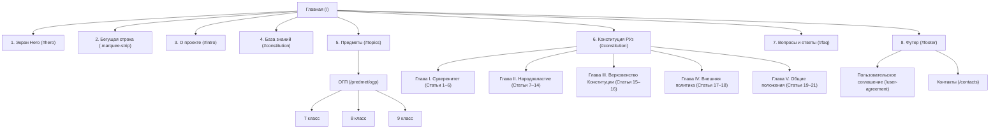

# Архитектурный Блюпринт и Спецификация Сайта: «Фундамент Знаний» (fundament-znaniy.uz)

> **Версия документа:** 1.0.0 (Релиз 2026)  
> **Статус проекта:** Production / Образовательный портал Республики Узбекистан  
> **Канонический URL:** [https://fundament-znaniy.uz](https://fundament-znaniy.uz)  
> **Куратор:** Алмаз Зафарович  
> **Разработчик:** Убайдуллаев Дильшод  

---

## 1. Бренд и Мета-информация (Brand Identity & Meta)

### 1.1. Базовые реквизиты
* **Название проекта:** «Фундамент Знаний»
* **Международное / латинское написание:** *Fundament Znaniy*
* **Год основания / актуальности:** 2026
* **Слоган / Описание проекта:** «Фундамент Знаний — образовательный сайт по познавательному контенту и Конституция Узбекистана.»
* **Главный дескриптор в Hero:** «Фундамент Знаний — Здесь вы сможете найти полезную информацию об статьях, знания из книг и многое другое.»
* **Географический и временной маркер (Eyebrow Badge):** `УЗБЕКИСТАН · 2026`
* **Контактный Email:** `malivochkiru@gmail.com`
* **Копирайт:** `© 2026 Fundament Znaniy. Все права защищены.`

### 1.2. Графические ассеты и логотипы
* **Фавикон и мобильный значок:** `logo-site-cp.png` (PNG с прозрачностью, квадратный значок с золотисто-синей эмблемой щита и страниц знаний).
* **Основной логотип шапки / футера:** `logo-site-cp.png`
* **Иллюстративный логотип интро-блока:** `logo-site.png` (высокое разрешение, 450px ширина).
* **Векторный щит Hero-секции:** Двухконтурный SVG-щит с анимацией мягкого покачивания:
  ```xml
  <svg class="shield-svg" viewBox="0 0 200 240" fill="none" xmlns="http://www.w3.org/2000/svg">
    <path d="M100 10L20 40V110C20 160 60 200 100 220C140 200 180 160 180 110V40L100 10Z" stroke="white" stroke-width="2" fill="none" />
    <path d="M100 30L36 55V110C36 150 68 185 100 203C132 185 164 150 164 110V55L100 30Z" stroke="white" stroke-width="1" fill="none" opacity=".4" />
  </svg>
  ```

---

## 2. Дизайн-система и Цветовые токены (Design System & CSS Tokens)

### 2.1. Цветовая палитра (CSS Custom Properties)
| CSS Переменная | Значение HEX/RGBA | Назначение в интерфейсе |
| :--- | :--- | :--- |
| `--ink` | `#060608` | Основной ультра-тёмный фон страницы |
| `--inkSecondary` | `#080810` | Фоновый цвет секции «О проекте» (`#intro`) |
| `--inkTertiary` | `#08080f` | Фоновый цвет секции «База знаний» (`#constitution`) |
| `--paper` | `#eeeae0` | Основной тёплый молочный текст заголовков и акцентов |
| `--accent` | `#4f8ef7` | Главный неоновый синий акцент (ссылки, бордеры, свечение) |
| `--accent2` | `#a855f7` | Вторичный фиолетовый акцент (градиенты, блики) |
| `--accent3` | `#06d6a0` | Изумрудный акцент (прогресс-бар, маркеры) |
| `--rust` | `#f97316` | Тёплый терракотово-оранжевый (глитч-эффект, лейблы номеров) |
| `--fog` | `#9ca3af` | Приглушённый серый текст второстепенных сносок |
| `--fog2` | `#c8cdd5` | Светло-серый текст параграфов и описаний |
| `--border` | `rgba(79, 142, 247, 0.12)` | Активная полупрозрачная рамка карточек |
| `--border2` | `rgba(79, 142, 247, 0.06)` | Базовая деликатная рамка блоков |
| `--widget-btn` | `linear-gradient(135deg, #0ea5e9, #0284c7)` | Плавающий виджет обратной связи |

### 2.2. Типографика (Typography Stack)
* **Заголовки и логотип:** `Montserrat, sans-serif` (300, 400, 500, 600, 700, 800)
* **Основной текст и списки:** `Nunito, sans-serif` (300, 400, 500, 600, 700)
* **Лирические и философские акценты (em-теги):** `Cormorant Garamond, serif` (300, 400 italic)
* **Инженерные плашки, бейджи, хлебные крошки:** `Space Mono, monospace` (400, 700)

### 2.3. Атмосферные и световые эффекты
1. **CRT-сканлайны (Scanlines):** На экранах `>=768px` накладывается оверлей с тонкими полупрозрачными горизонтальными линиями (`repeating-linear-gradient(0deg, transparent, transparent 3px, rgba(0,0,0,0.04) 3px 4px)`).
2. **Техническая сетка (Subtle Grid):** Фоновый паттерн `72px × 72px` на базе `linear-gradient(rgba(79, 142, 247, 0.04) 1px, transparent 1px)`.
3. **Плавающие сферы (Radial Glowing Orbs):** Размытые радиальные градиенты с анимацией `orbFloat` (смещение по вертикали и масштабирование с циклом 6–10с).
4. **Стеклянный морфизм (Glassmorphism):** Бэкдроп-блюр `14px–20px` в навигации, карточках прелоадера и выдвижных меню.

---

## 3. Интерактивный Прелоадер (Preloader Specification)

* **Контейнер:** `#preloader` (фиксированный оверлей `#050508`, `z-index: 9000`)
* **Орбитальная подсветка:**
  * `.pre-orb-1`: синий градиент (`top: 15%, left: 15%`, `filter: blur(80px)`)
  * `.pre-orb-2`: фиолетовый градиент (`bottom: 15%, right: 15%`, `filter: blur(80px)`)
* **Центральная плашка (Pre-Card):**
  * Размеры: `width: min(90vw, 420px)`, `border-radius: 24px`, фон `rgba(10, 10, 16, 0.75)` с `backdrop-filter: blur(20px)`.
  * Логотип: `logo-site-cp.png` (110×110px) с пульсирующей тенью `preLogoPulse`.
  * Индикатор состояния: Текст `ИНИЦИАЛИЗАЦИЯ` (Space Mono, letter-spacing: 5px, 11px).
  * Числовой счётчик: От `0%` до `100%` (шрифт Montserrat 800, градиент от белого через синий в фиолетовый).
  * Полоса прогресса: Высота `5px`, скругление `99px`, градиент `#4f8ef7` → `#a855f7` → `#06d6a0` со светящейся точкой `.pre-glow-dot`.
  * Фирменная подпись: `ФУНДАМЕНТ ЗНАНИЙ`.

---

## 4. Архитектура навигации (Navigation Structure)

### 4.1. Карта сайта и навигационные связи



### 4.2. Верхняя фиксированная панель (Header Nav)
* **Контейнер:** `#main-nav` (`backdrop-filter: blur(14px)`, фон `rgba(5, 5, 8, 0.58)`).
* **Логотип бренда:**
  * Иконка `logo-site-cp.png` в стеклянном контейнере со скруглением `12px` и подсветкой.
  * Текст в две строки: `ФУНДАМЕНТ` (заголовок, 13px, трекинг 4px) / `ЗНАНИЙ` (подзаголовок, 11px, трекинг 6px, цвет `#c8cdd5c7`).
* **Элементы управления справа:**
  * Кнопка-ссылка `ГЛАВНАЯ` (шрифт Montserrat 600, 13px).
  * Бургер-кнопка меню (`#nav-burger`) из трёх полос (`24px × 1px`).

### 4.3. Выдвижное мобильное меню (Mobile Drawer Overlay)
* **Секция «Страницы»:**
  1. `Главная` (URL: `/`, иконка: Дом)
  2. `Пользовательское соглашение` (URL: `/user-agreement`, иконка: Документ)
  3. `Контакты` (URL: `/contacts`, иконка: Почтовый конверт)
* **Секция «Предметы» (Вложенный аккордеон):**
  * Предмет `ОГП` → Классы: `7 класс`, `8 класс`, `9 класс` → Главы → Разделы (см. раздел 7).
* **Секция «Конституция РУз» (Живой поиск):**
  * Поле поиска: `<input placeholder="Поиск по Главам / Статьям…">` с кнопкой быстрой очистки `✕`.
  * Блок пустого состояния: `Ничего не найдено. Попробуйте изменить запрос`.
  * Иерархический список Глав (I–V) и сетка прямых ссылок на статьи 1–21.

---

## 5. Главный Экран (Hero Section)

### 5.1. Структура и компоненты
* **Бейдж-надпись (Eyebrow):**  
  Плашка с неоновым бордером: `УЗБЕКИСТАН · 2026`.
* **Главный заголовок (H1):**
  ```html
  <h1 class="hero-title">
    <span class="line"><span class="glitch" data-text="Фундамент Знаний">Фундамент</span></span>
    <span class="line"><span class="accent">Знаний</span></span>
  </h1>
  ```
  * Стилизация первой строки: CSS-эффект глитча с псевдоэлементами `:before` (терракотовая тень) и `:after` (фиолетовая тень) со случайным смещением `clip-path`.
  * Стилизация второй строки: фирменный неоновый акцентный цвет `--accent` (`#4f8ef7`).
* **Дескриптор / Описание:**  
  *«Фундамент Знаний — Здесь вы сможете найти полезную информацию об статьях, знания из книг и многое другое.»*  
  (Шрифт Nunito, цвет `--fog2`, `max-width: 460px`, `line-height: 1.9`).
* **Основная кнопка призыва к действию (CTA):**  
  * Текст: `Начать изучение`
  * Ссылка: якорный переход `#topics`
  * Класс: `.btn-outline` (неоновый бордер, заглавные буквы, трекинг 3px, плавный ховер с подсветкой).
* **Индикатор прокрутки (Scroll Indicator):**  
  * Вертикальный текст: `Фундамент Знаний` (`writing-mode: vertical-rl`, трекинг 4px, размер 9px).
  * Пульсирующая градиентная линия высотой 48px.
* **Фоновые графические элементы:**  
  * Центральная световая сфера `orb-center` (`blur: 60px`, размер 300–600px).
  * Боковые сферы `hero-orb-1` и `hero-orb-2`.
  * Анимированный векторный щит справа со смещением и покачиванием.

---

## 6. Бегущая строка (Marquee Ticker)

* **Фон и бордеры:** Тонкая полоса с полупрозрачным фоном `#4f8ef705`, верхняя и нижняя границы `1px solid #4f8ef714`.
* **Анимация:** Бесшовный горизонтальный цикл с аппаратным ускорением (`28s linear infinite` для десктопа, `22s` для мобильных).
* **Содержимое элементов тикера (Marquee Items):**
  1. `Фундамент Знаний`
  2. `Узбекистан`
  3. `Конституция РУз`
  4. `Статьи РУз`
  5. `Политика`
  6. `Открытые Источники`
* **Разделитель:** Неоновый круглый маркер `●` (`color: var(--accent)`, размер 8px, отступы 44px).

---

## 7. Секция «О проекте» (Intro)

* **Идентификатор секции:** `#intro`
* **Фоновый оттенок:** Темный графит `#080810`
* **Колоночный макет:** 2 колонки (`1.1fr` текст / `0.9fr` визуальный блок, на мобильных вертикальный стек).
* **Заголовочная группа:**
  * Лейбл секции: `О проекте` (Space Mono, трекинг 6px).
  * Заголовок: `Фундамент - <br><em>Знаний</em>` (слово «Знаний» оформлено курсивом Cormorant Garamond).
  * Приветственный текст:  
    *«Добро пожаловать на «Фундамент Знаний»! На нашем сайте мы собрали всё самое необходимое для интеллектуального развития. Здесь вас ждут:»*
* **Маркированный список с фирменными стрелками (`.arrow-list`):**
  * `→` **Познавательные статьи и материалы.**
  * `→` **Практические советы и лайфхаки на каждый день.**
* **Визуальный фрейм:**  
  Стеклянная рамка с логотипом проекта `logo-site.png` с эффектом внутреннего свечения.

---

## 8. Секция «База знаний» (Knowledge Base / Pillars of Development)

* **Идентификатор секции:** `#constitution`
* **Фоновый оттенок:** `#08080f`
* **Заголовок секции:**
  * Лейбл: `База знаний`
  * Заголовок: `Фундамент <br><em>вашего развития</em>`
* **Сетка карточек:** 4 карточки в сетке 2×2 (`.const-layout`):

### Карточка 1: Статьи
* **Надзаголовок (Метка):** `Статьи`
* **Заголовок:** `Полезные материалы`
* **Содержимое параграфов:**  
  *«На сайте собраны авторские публикации на самые актуальные темы. Мы тщательно отбираем и структурируем информацию, чтобы предоставлять вам только качественный и интересный контент.»*  
  *«Читайте наши статьи, чтобы постоянно расширять кругозор, находить свежие идеи и получать ответы на интересующие вас вопросы в удобном формате.»*

### Карточка 2: Литература
* **Надзаголовок (Метка):** `Литература`
* **Заголовок:** `Знания из книг`
* **Содержимое параграфов:**  
  *«Нет времени читать сотни страниц? Мы подготовили для вас выжимки главных мыслей, концепций и инсайтов из лучших книг по саморазвитию.»*

### Карточка 3: Практика
* **Надзаголовок (Метка):** `Практика`
* **Заголовок:** `Прикладной опыт`
* **Содержимое параграфов:**  
  *«Любая теория приобретает истинную ценность только на практике. Наш проект акцентирует внимание на практических советах, рабочих лайфхаках и проверенных методиках.»*  
  *«Формируйте полезные привычки, тренируйте критическое мышление и эффективно достигайте поставленных целей, используя собранные нами инструменты.»*

### Карточка 4: Миссия сайта
* **Надзаголовок (Метка):** `Миссия сайта`
* **Заголовок:** `Надёжная основа`
* **Содержимое параграфов:**  
  *««Фундамент Знаний» — это современная площадка для тех, кто стремится к непрерывному интеллектуальному росту. Мы верим, что доступ к правильной информации меняет жизнь.»*  
  *«Инвестируйте время в свое развитие. Заложите прочный фундамент своего интеллекта вместе с нами, узнавая что-то новое каждый день.»*

---

## 9. Секция «Предметы» (Curriculum & Academic Structure)

* **Идентификатор секции:** `#topics`
* **Лейбл:** `Предметы`
* **Заголовок:** `Предметы <br>для изучения материалов`
* **Подзаголовок:** *«Выберите предметы / классы / главы / разделы - чтобы подробнее ознакомиться с каждым материалом.»*
* **Витринная карточка предмета 01:**
  * **Номер:** `01`
  * **Бейдж:** `ОГП`
  * **Название:** `Основы государственной политики — предмет, формирующий гражданскую компетентность и правовую культуру учащихся`
  * **Кнопка-ссылка:** `Изучить →` (URL: `/predmet/ogp`)
  * **Водяной фоновый знак:** `🛡️` (Геральдический щит)

### 9.1. Полное древо учебной программы предмета «ОГП»

```
Основы государственной политики (ОГП)
│
├── 7 класс (/predmet/ogp/class/7-klass)
│   ├── Глава 1: Введение в общество и правила поведения
│   │   ├── Раздел: Социальные нормы и правила в обществе
│   │   └── Раздел: Дисциплина, порядок и закон
│   ├── Глава 2: Права ребенка
│   │   ├── Раздел: Конвенция ООН о правах ребенка
│   │   └── Раздел: Государственные гарантии защиты прав детей
│   └── Глава 3: Государственная символика
│       ├── Раздел: Уважение к Государственному флагу, гербу и гимну
│       └── Раздел: Национальные ценности и патриотизм
│
├── 8 класс (/predmet/ogp/class/8-klass)
│   ├── Глава 1: Конституция — Основной закон государства
│   │   ├── Раздел: Понятие Конституции и её значение
│   │   └── Раздел: Основы конституционного строя
│   ├── Глава 2: Права и свободы человека и гражданина
│   │   ├── Раздел: Личные права и свободы
│   │   └── Раздел: Политические, экономические и социальные права
│   └── Глава 3: Государственное устройство Республики Узбекистан
│       ├── Раздел: Органы государственной власти
│       └── Раздел: Местное самоуправление
│
└── 9 класс (/predmet/ogp/class/9-klass)
    ├── Глава 1: Международное право и права человека
    │   ├── Раздел: Понятие и принципы международного права
    │   └── Раздел: Международная защита прав человека
    ├── Глава 2: Избирательное право и избирательная система
    │   ├── Раздел: Избирательное право в Республике Узбекистан
    │   └── Раздел: Избирательный процесс и политические партии
    └── Глава 3: Гражданское общество и государство
        ├── Раздел: Понятие гражданского общества
        └── Раздел: Институты гражданского общества
```

---

## 10. Секция «Конституция РУз» (Constitution of Uzbekistan)

* **Идентификатор секции:** `#constitution` (раздел Конституции)
* **Лейбл:** `Конституция РУз`
* **Заголовок:** `Конституция <br><em>Республики Узбекистан</em>`
* **Подзаголовок:** *«Изучите статьи Конституции Республики Узбекистан — основного закона страны.»*
* **Сетка карточек Глав:** 3-колоночная адаптивная сетка с интерактивными ссылками на главы и статьи.

### 10.1. Каталог карточек Глав

| № | Глава | Краткое описание содержания | Входящие статьи | Ссылка главы |
|---|---|---|---|---|
| **01** | **Глава I. Государственный суверенитет** | Статьи 1–6. Суверенитет, служение народу, устройство государства, язык, символы и столица. | Статья 1, Статья 2, Статья 3, Статья 4, Статья 5, Статья 6 | `/statyi/konstitutsiya-uzbekistana-glava-1` |
| **02** | **Глава II. Народовластие** | Статьи 7–14. Народ как источник власти, представительство, референдум, разделение властей, плюрализм и ценностные основы демократии. | Статья 7, Статья 8, Статья 9, Статья 10, Статья 11, Статья 12, Статья 13, Статья 14 | `/statyi/konstitutsiya-uzbekistana-glava-2` |
| **03** | **Глава III. Верховенство Конституции и закона** | Статьи 15–16. Верховенство Конституции и закона, высшая юридическая сила и прямое действие, основы правовой системы и требования к нормативным актам. | Статья 15, Статья 16 | `/statyi/konstitutsiya-uzbekistana-glava-3` |
| **04** | **Глава IV. Внешняя политика** | Статьи 17–18. Принципы международных отношений, миролюбие и формы международного сотрудничества. | Статья 17, Статья 18 | `/statyi/konstitutsiya-uzbekistana-glava-4` |
| **05** | **Глава V. Общие положения (Права, свободы и обязанности)** | Статьи 19–21. Признание и гарантия прав человека, равенство, взаимные обязанности государства и гражданина, непосредственное действие прав и принцип соразмерности. | Статья 19, Статья 20, Статья 21 | `/statyi/konstitutsiia-respubliki-uzbekistan-osnovnye-prava-svobody-i-obiazannosti-cheloveka-i-grazhdanina-glava-v-obshchie-polozheniia` |

* **Фоновый водяной знак карточек:** `⚖️` (Весы правосудия)
* **Пагинация / Навигация:** Модуль пагинации `.topics-pagination` с индикатором страницы `1 / 1` и кнопками «Назад» / «Вперёд».

---

## 11. Секция «FAQ» (Вопросы и Ответы)

* **Идентификатор секции:** `#faq`
* **Лейбл:** `FAQ`
* **Заголовок:** `Ответы на вопросы`
* **Подзаголовок:** `Ответы на интересные вопросы.`
* **Механика:** Интерактивный аккордеон с вращающейся иконкой `+` → `×` при раскрытии.

### Реестр вопросов и полных официальных ответов:

1. **Вопрос:** *Для чего предназначен этот сайт?*  
   **Ответ:** *«Наш сайт является официальной образовательной платформой учебного центра «Fundament Znaniy». Здесь вы можете ознакомиться с учебными предметами, прочитать статьи, изучить Конституцию Республики Узбекистан и получить доступ к учебным материалам.»*

2. **Вопрос:** *Как найти нужные учебные материалы на сайте?*  
   **Ответ:** *«Все материалы структурированы по иерархии: «Предметы» → «Классы» → «Главы» → «Разделы». Вы можете выбрать интересующий вас предмет на главной странице и по шагам перейти к конкретному уроку или лекции.»*

3. **Вопрос:** *Обязательно ли регистрироваться для просмотра материалов?*  
   **Ответ:** *«Большая часть информационных материалов и разделов Конституции доступна для чтения всем посетителям сайта без регистрации. Личный кабинет и специфические функции предназначены для администраторов.»*

4. **Вопрос:** *Где я могу ознакомиться с юридическими условиями использования сайта?*  
   **Ответ:** *«В самом низу сайта (в футере) расположена ссылка на «Пользовательское соглашение». Там подробно описаны правила использования материалов сайта, правила конфиденциальности и условия авторского права.»*

---

## 12. Подвал сайта (Footer Specification)

* **Контейнер:** `footer` (фон `#030305`, верхний бордер `1px solid var(--border2)`).
* **Сетка колонок (4 колонки):**
  1. **Колонка 1 — Бренд и Миссия:**
     * Логотип: `logo-site-cp.png` (42px).
     * Название бренда: `FUNDAMENT ZNANIY` (Montserrat 700, 20px).
     * Дескриптор: `Образовательный сайт.`
     * Предусмотренные социальные профили: Telegram, Instagram, YouTube, Facebook.
  2. **Колонка 2 — Страницы:**
     * `Главная` (`/`)
     * `Пользовательское соглашение` (`/user-agreement`)
     * `Контактная форма` (`/contacts`)
  3. **Колонка 3 — Обучение:**
     * `ОГП` (`/predmet/ogp`)
     * `Конституция РУз` (`/statyi`)
  4. **Колонка 4 — Контакты:**
     * Иконка почты + ссылка: `Gmail - malivochkiru@gmail.com`
* **Нижняя полоса авторских прав (Footer Bottom Bar):**
  * Слева: `© 2026 Fundament Znaniy. Все права защищены.`
  * Справа:  
    `Куратор:` **Алмаз Зафарович**  
    `Разработчик:` **Убайдуллаев Дильшод**

---

## 13. Плавающий виджет поддержки (Support Widget)

* **Идентификатор:** `#float-widget` (позиция: `fixed; bottom: 24px; right: 24px; z-index: 9998`).
* **Кнопка вызова:** Круглая кнопка 56×56px в стиле Bitrix24 CRM с градиентом от `#0ea5e9` до `#0284c7`, тенью и белой SVG-иконкой диалога поддержки.
* **Всплывающее окно (Popup):**
  * Заголовок: `Техподдержка` с кнопкой закрытия `×`.
  * Пояснительный текст: *«Нашли ошибку или недочет в работе сайта? Пожалуйста, напишите нам»*
  * Кнопка действия: `Написать в поддержку` (URL: `/contacts`, открывается в новой вкладке `target="_blank"`).

---

## 14. Модальные окна (Modals)

* **Медиа-модаль (`#media-modal`):**
  * Затемнение с эффектом `backdrop-filter: blur(10px)`.
  * Центрированный контейнер для отображения изображений, видео и iframe-плееров с соотношением 16:9.
  * Кнопка закрытия `✕` в правом верхнем углу (`44px × 44px`).
